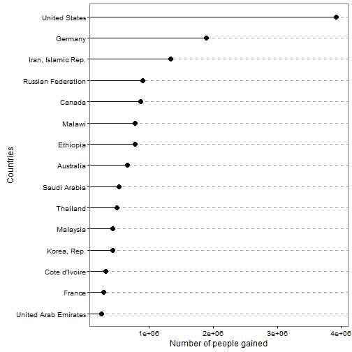
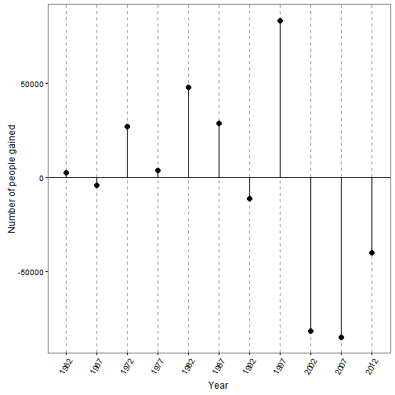

Net migration of people around the world
========================================================
author: 
date: 
transition: rotate

Net migration
========================================================

Net migration is the difference of immigrants and emigrants of a country in a period of time. A positive value represents more people entering the country than leaving it, while a negative value means more people leaving than entering it.

Data and App
========================================================
Data was obtained from the UNdata website. 

This App shows countries with the highest and lowest net migration for a given year in the peroid from 1962 to 2012. 

It also shows year-by-year net migration value of any country during this peroid.

Example of display (I)
========================================================
The following graph shows the top 15 countries with the highest net migration in 1987.

 

Example of display (II)
========================================================
The following graph shows the net migration of Zambia from 1962 to 2012. 

 

